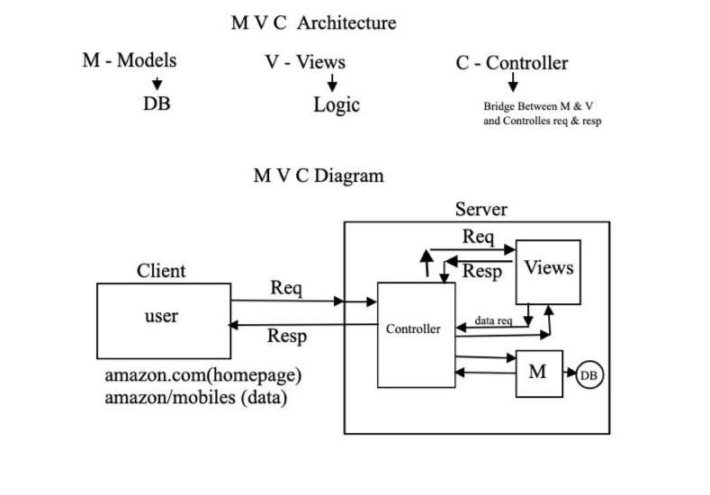

# Learning Django

Learning Django from Rajat Naroji sir


## MVC architecture 



## MVT architecture (used by Django)


## Reload browser automatically

- Install

```batch
pip install django-browser-reload
```

- modify settings.py

```django
INSTALLED_APPS = [
    ...existing code...
    "django_browser_reload",
    ...existing code...
]

MIDDLEWARE = [
    ...existing code...
    "django_browser_reload.middleware.BrowserReloadMiddleware",
    ...existing code...
]
```

- add to main urls.py

```django
from django.urls import include, path

urlpatterns = [
    ...existing code...
    path("__reload__/", include("django_browser_reload.urls")),
]
```

- finally run server

```python
python manage.py runserver
```

## Todo: Faker data

<br><br>

## How to check Django DB connection

- Open shell

   ```django
   py manage.py shell
   ```
- Inside shell, perform the following

   ```
   from django.db import connection
   c = connection.curson()
   print(c)
   ```
- If the connection is extablished, connection object will be returned else ERROR.

## Todo: connecting MYSQL db

# MySQL Installation and Django Configuration Guide

## Step 1: Install MySQL Server on Windows

1. **Download MySQL**
   - Go to [MySQL Downloads](https://dev.mysql.com/downloads/installer/) and download the MySQL Installer.

2. **Run the Installer**:
   - Run the downloaded installer.
   - Choose the **Server Only** setup type (or another setup type that includes the MySQL Server).
   - During installation, set a **root password** — remember this for later!
   - Complete the installation.

3. **Verify MySQL Installation**:
   - Open the **MySQL Command Line Client** from the Start menu.
   - Enter the root password you set during installation.
   - If connected successfully, you should see:
     ```
     mysql>
     ```

## Step 2: Install `mysqlclient` (MySQL Adapter)

- This is the adapter that allows Django to connect to MySQL.

   ```bash
   pip install mysqlclient
   ```

## Step 3: Configure MySQL Database in Django

1. **Create a Database in MySQL**:

   - Open the **MySQL Command Line Client** and create a new database for your project:
     
      ```sql
      CREATE DATABASE your_db_name;
      ```

2. **Update `settings.py` in Django**:

   - In your Django project, open the `settings.py` file and configure the `DATABASES` setting like this:

      ```python
      DATABASES = {
         'default': {
            'ENGINE': 'django.db.backends.mysql',
            'NAME': 'your_db_name',        # The database you just created
            'USER': 'root',                # Default user
            'PASSWORD': 'your_password',   # Password you set during installation
            'HOST': 'localhost',
            'PORT': '3306',
         }
      }
      ```

## Step 4: Run Django Migrations

- This will apply all migrations and create the default Django tables (like `auth`, `sessions`, etc.) in your MySQL database.

   ```bash
   python manage.py makemigrations
   python manage.py migrate
   ```

## Step 5: Verify the Connection

- Run the development server:

   ```bash
   python manage.py runserver
   ```

- Go to `http://127.0.0.1:8000/` in your browser.

- If everything is set up correctly, your Django app should be running, and data will be stored in MySQL.

## Conclusion

- You're now using MySQL with Django!