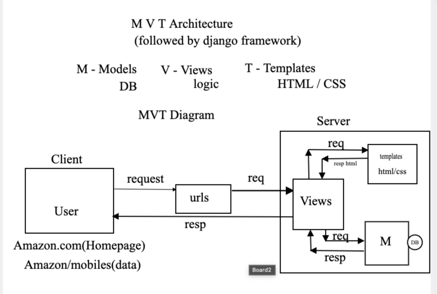

# Learning Django

Learning Django from Rajat Naroji sir


## MVC architecture 


## MVT architecture (used by Django)


## Reload browser automatically

- Install

```batch
pip install django-browser-reload
```

- modify settings.py

```django
INSTALLED_APPS = [
    ...existing code...
    "django_browser_reload",
    ...existing code...
]

MIDDLEWARE = [
    ...existing code...
    "django_browser_reload.middleware.BrowserReloadMiddleware",
    ...existing code...
]
```

- add to main urls.py

```django
from django.urls import include, path

urlpatterns = [
    ...existing code...
    path("__reload__/", include("django_browser_reload.urls")),
]
```

- finally run server

```python
python manage.py runserver
```

## Todo: Faker data

## Todo: connecting MYSQL db