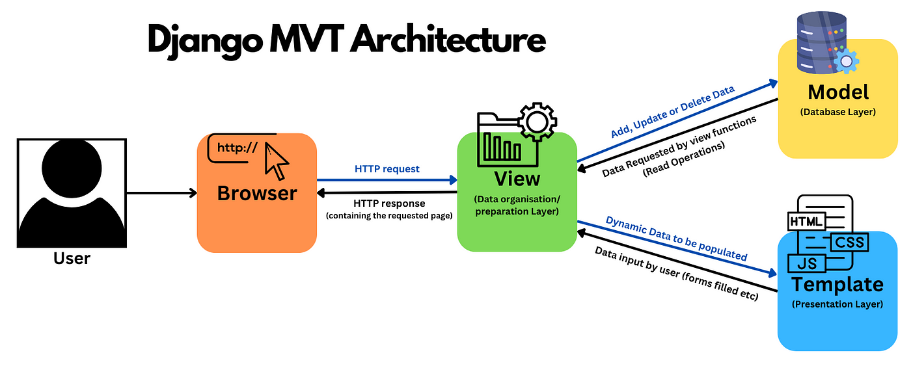

# Learning Django

Learnt Django from [Rajat Naroji](https://www.linkedin.com/in/rajat-naroji-a7bb15297/) sir

<!--  -->

## Learnings 📚

> Topics and terms related to the course

`Instruction` `Program` `Software` `System software` `Application software` [`Client`](https://github.com/topics/client) [`Server`](https://github.com/topics/server) `Database` [`Frontend`](https://github.com/topics/frontend) [`Backend`](https://github.com/topics/backend) `Package` `Module` [`Framework`](https://github.com/topics/framework) `Library` `MVC` [`MVT`](https://github.com/topics/mvt) [`models`](https://github.com/topics/models) [`views`](https://github.com/topics/views) [`templates`](https://github.com/topics/templates) `Request` `Response` [`Virtual environment`](https://github.com/topics/virtual-environment) `System environment` [`Python`](https://github.com/topics/python) [`Django`](https://github.com/topics/django) `Requirements.txt` [`Uv package`](https://github.com/topics/uv) `Open source` [`Admin panel`](https://github.com/topics/admin-panel) [`SQLite3`](https://github.com/topics/sqlite) `SQL` `URL / path` `Route (parent, child, default)` `Project` `App` [`Configuration folder`]() `Manage.py` `HttpResponse` `Register` [`App level url`]() `Include()` `App level template and static` [`Project level template and static`]() `Render()` [`Template inheritance`](https://github.com/topics/template-inheritance) `Boilerplate code` [`DRY`](https://github.com/topics/dry) `Code reusability` [`DTL tags`](https://github.com/topics/dtl) `(block, extends, include, variable, load, for, if, url)` [`Context`](https://github.com/topics/context) `Inject dynamic data` `Manual routing` [`Dynamic routing`](https://github.com/topics/dynamic-routing) `Conditional rendering` `conditional filtering` [`ORM`](https://github.com/topics/orm) `SQL queries` [`Makemigrations`](https://github.com/topics/makemigrations) `sqlmigrate` `migrate` `CRUD (Admin Panel)` `Createsuperuser` `CRUD (Shell)` `Interactive console` `querySet` `CRUD (views/forms)` `MySQL` [`PostgreSQL`](https://github.com/topics/postgresql) [`Authentication-Authorisation`](https://github.com/topics/authentication-authorisation) `Session based` `Inbuilt User model` `Credential` `Encryption` `Decryption` `Login` `Logout` `Browser storage / Session storage` `Integrity error` `Search functionality` [`Django forms`](https://github.com/topics/django-forms) `csrf_token` [`Django modelForm`](https://github.com/topics/django-modelForms) `Message module` `Error / warning / success` [`Django Relationships`]() `Primary key` `Foreign key` `Many-many relation` `One-one relation` `DRF` [`django-rest-framework`](https://github.com/topics/django-rest-framework) [`API`](https://github.com/topics/api) [`REST API`](https://github.com/topics/rest-api) `Endpoints` [`Requests module`](https://github.com/topics/requests) [`JsonResponse`](https://github.com/topics/json) `http status codes` `CRUD (api)` `Get` `Post` `Put` `Patch` `Delete` [`Serialization`](https://github.com/topics/serialization) `Deserialization` [`Serializers`](https://github.com/topics/serializers) `ModelSerializer` [`JSON`](https://github.com/topics/json) [`API Testing`](https://github.com/topics/api-testing) `Insomnia` [`Bruno`](https://github.com/usebruno/bruno) [`Postman`](https://github.com/topics/postman) `csrf_exempt` 
 
 
## Projects Built During the Course 🛠️

| SN | Project Name | Tech / concepts implemented | Demo / Code |
| :--------------: | :--------------: | :------------: | :-------------: |
| 1 | **Indian Defence** | Django, HTML, CSS, dtl tags, context, template inheritance,dynamic routing, dictionary | [Code](https://github.com/Rahullkumr/LearningDjango/tree/main/assignments/Assignment07_4projects) / [Demo](#) |
| 2 | **Travel Guide** | Django, SQLite3 | [GitHub](https://github.com/rahullkumr/baaaad_me) |
| 3 | **HMS (receptionist page)** | Django, SQLite3 | [GitHub](https://github.com/rahullkumr/baaaad_me) |
| 4 | **Student Mgmt Sys** | Django, PostgreSQL | [GitHub](https://github.com/rahullkumr/baaaad_me) |
| 5 | **Auth System** | Django, SQLite3 | [GitHub](https://github.com/rahullkumr/baaaad_me) |
| 6 | **Django Forms** | Django, SQLite3 | [GitHub](https://github.com/rahullkumr/baaaad_me) |
| 7 | **Message module** | Django, SQLite3 | [GitHub](https://github.com/rahullkumr/baaaad_me) |
| 8 | **Article** | Django, SQLite3, HTML, CSS, dtl tags, conditional rendering, context, global templates, template inheritance, redirect, dynamic routing, path converter, Models, ORM, CRUD, Authentication-Authorisation,login, logout, session storage, Admin panel, Inbuilt User model, Search | [GitHub](https://github.com/rahullkumr/baaaad_me) |
| 9 | **Todo list** | Django, SQLite3, HTML, CSS, dtl tags, conditional rendering, context, global templates, template inheritance, redirect, dynamic routing, path converter, Models, ORM, CRUD, Authentication-Authorisation,login, logout, session storage, Inbuilt User model, Search | [GitHub](https://github.com/rahullkumr/baaaad_me) |
| 10 | **Relationships** | Django, SQLite3 | [GitHub](https://github.com/rahullkumr/baaaad_me) |
| 11 | **ShopSphere** | Django, SQLite3 | [GitHub](https://github.com/rahullkumr/baaaad_me) |
| 12 | **Weather app** | Django, REST API | [GitHub](https://github.com/rahullkumr/baaaad_me) |

## Following are the Projects

### 1. Indian Defence

 

### 2. Travel Guide

 

### 3. HMS (receptionist page)

 

### 4. Student Mgmt Sys (PostgreSQL)

 

### 5. Auth System

 

### 6. Django Forms

 

### 7. Message module

 

### 8. Article

 

### 9. Todo list

 

### 10. Relationships

 

### 11. ShopSphere (final project)

 

### 12. Weather app

 
